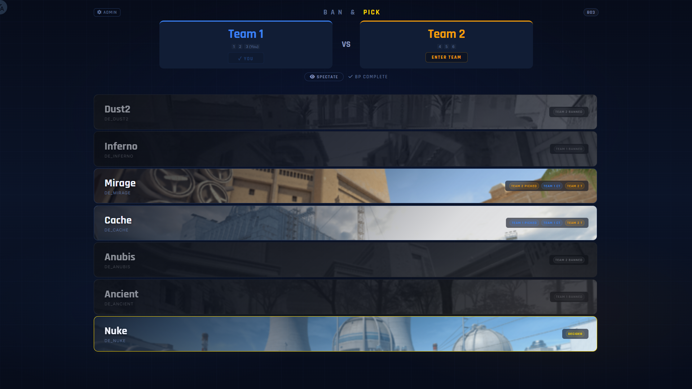
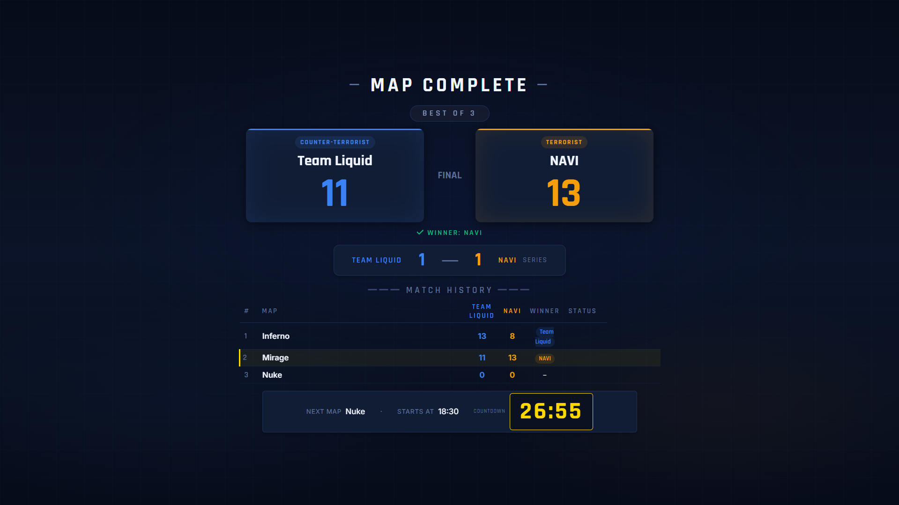

# CS2 HUD Matchless

A broadcast HUD toolkit for CS2 competitive matches, covering all **non-gameplay** presentation scenes — map ban/pick, pre-match countdown, halftime, between-maps, technical pause, post-match results, and more. Designed for 16:9 at 1920×1080 and above.

> **Portions of this project were developed with AI assistance.**





## Modules

| Page | Description |
|------|-------------|
| **BanPick.html** | Standalone map ban/pick screen. Supports BAN / PICK / SET CT side actions with a playback animation sequence. |
| **PreMatch.html** | Pre-match "Starting Soon" display. Shows both teams, map info, picker, with an auto countdown based on a set start time. |
| **Halftime.html** | Halftime display. Shows team names, scores, map info, picker, and a countdown timer. |
| **BetweenMaps.html** | Between-maps transition screen. Shows the just-finished map result, series score, match history table, next map, and auto countdown. |
| **Results.html** | Post-match results. Shows the champion, final series score, and a map-by-map breakdown table. |
| **TechBreak.html** | Technical pause screen. Shows pause icon, custom reason, team names, current map, and an elapsed-duration counter. |
| **RealtimeBP.html** | Real-time multiplayer ban/pick. Uses WebSocket (Socket.IO) to power captain-based or team-voting BP for BO1/BO3/BO5 formats. |
| **bp_server.py** | Flask-SocketIO backend server driving RealtimeBP. Supports HTTPS, configurable map pools, and password-based auth. |
| **bp_admin.py** | CLI admin tool to manage passwords, map pools, BO format, entry mode, and SSL settings. |

## Quick Start

### Static Pages

Simply open any `.html` file in your browser. All fields are editable inputs — click **CONFIRM** to lock them into display mode.

### Real-time BP (RealtimeBP + bp_server)

```bash
# Install dependencies
pip install flask flask-socketio eventlet

# Configure passwords and settings (generates bp_config.json on first run)
python bp_admin.py

# Start the server
python bp_server.py
```

Open `http://localhost:5000` in a browser. The admin and both teams' captains/players can join and start the BP.

## Configuration (Real-time BP Server)

### Default Passwords

| Role | Password |
|------|----------|
| Admin | `admin` |
| Team 1 / Team 2 | `123456` |

### Changing Settings

**Option 1: CLI Tool**

```bash
python bp_admin.py
```

The interactive menu allows you to change admin passwords, team names & passwords, map pool, BO format, entry mode, HTTP/HTTPS ports, SSL certificates, and more.

**Option 2: Web UI**

Open the real-time BP page, click the **Admin** button in the top-left corner, and log in with the admin password. You can then modify map pool, BO, entry mode, team names, and passwords directly in the browser.

### Configuration Fields

| Field | Description |
|-------|-------------|
| `admin.password_hash` / `salt` | SHA-256 hash and salt for the admin password. Changed via `bp_admin.py` or the web Admin panel. |
| `teams.team1` / `teams.team2` | Team names, password hashes, and salts for each side. |
| `map_pool` | Map pool, e.g. `["de_dust2", "de_mirage", ...]`. Must match the image filenames in `res/`. |
| `bo` | Best-of format: `1`, `3`, or `5`. Each BO uses a different official BP sequence. |
| `entry_mode` | Entry mode: `captain` (one person per team) or `team` (multiple players can join and vote). |
| `http_port` | HTTP server port (default `5000`). |
| `https_port` | HTTPS server port (default `8443`). |
| `ssl.enable_https` | Enable HTTPS (`true` / `false`, default `false`). |
| `ssl.cert_dir` / `cert_file` / `key_file` | SSL certificate directory, certificate filename, and private key filename. |
| `ssl.domain` | Display-only — shown in the console startup message as the access URL. **Has no functional effect.** |

## Directory Structure

```
├── BanPick.html         # Standalone map BP page
├── PreMatch.html        # Pre-match screen
├── Halftime.html        # Halftime screen
├── BetweenMaps.html     # Between-maps screen
├── Results.html         # Post-match results screen
├── TechBreak.html       # Technical pause screen
├── RealtimeBP.html      # Real-time multiplayer BP page
├── bp_server.py         # Real-time BP backend server
├── bp_admin.py          # BP configuration CLI
├── bp_config.json       # BP server config (auto-generated)
├── bp_config.example.json # Example configuration file
├── css/                 # Standalone stylesheets
├── js/                  # Standalone scripts
├── res/                 # Map images and static assets
└── readme_snapshot/     # README screenshots
```

## Design Features

- Dark sci-fi aesthetic with blue/orange dual-color CT/T coding
- Responsive 16:9 layout, optimized for 1080p and above
- Rajdhani + Inter typeface pairing
- Unified Design System across all pages (CSS custom properties)
- Edit-then-confirm workflow: editable inputs lock into display state with one click

## Customization

- **Team names**: Input fields on each page support direct renaming
- **Map names & scores**: Free-form text and number inputs
- **BO format**: Custom series format strings accepted in PreMatch, BetweenMaps, and Results
- **Countdown**: PreMatch and BetweenMaps accept a target time and auto-calculate remaining time

## Credits

- Map images from [Liquipedia](https://liquipedia.net/)
- Icons by [Font Awesome](https://fontawesome.com/) (v6.5.1)
- AI-assisted development
- Licensed under the [MIT License](LICENSE)
